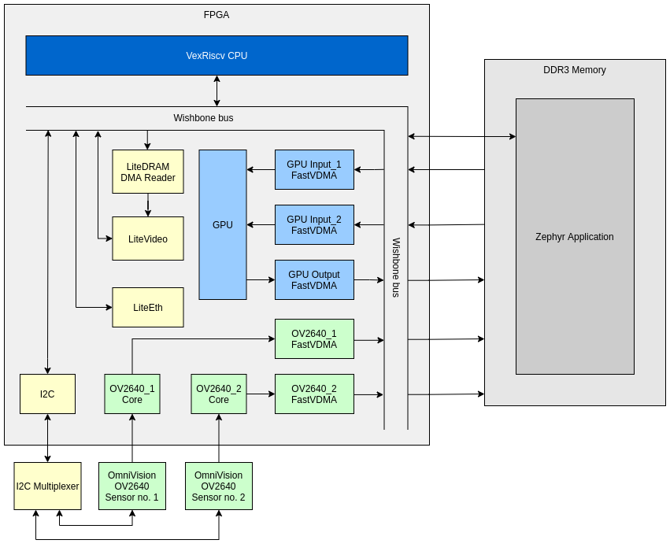
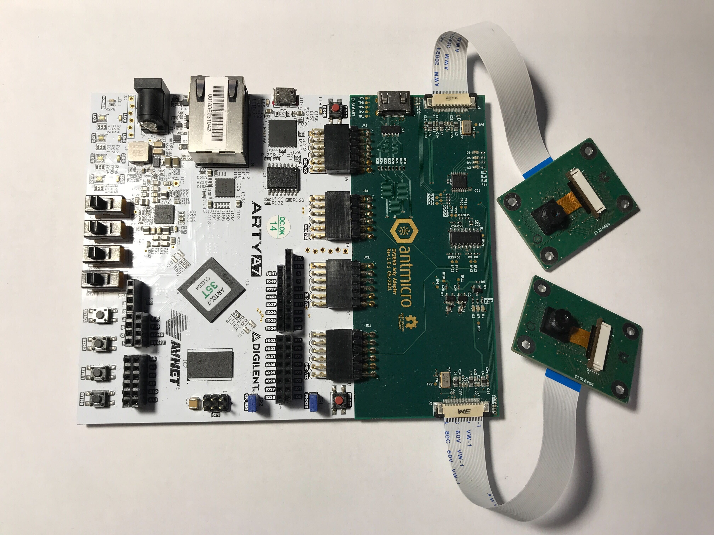

# Video Overlays Reference System

Copyright (c) 2021-2022 [Antmicro](https://www.antmicro.com)

## Overview

The Video Overlays project is a fully open source reference system for overlaying data onto a video stream on FPGA, based on the LiteX ecosystem and Zephyr RTOS. It provides an application with a CLI to control the OmniVision OV2640 camera configuration and a 2D GPU IP Core to capture and process images. The stream from the camera can be displayed directly via HDMI or can be first processed by the GPU to apply an overlay on top of it.

## Supported features

The application which provides a CLI which exposes many configuration possibilites to the user:
- camera configuration:
  - resolution,
  - brightness,
  - saturation,
  - quality,
  - white balance,
  - gain control,
  - exposure control,
  - horizontal flip,
  - vertical flip,
  - output format (JPEG, RGB565),
  - colorbar,
  - clock divider,

- display configuration:
  - resolution (640x480, 800x600, 1024x768, 1280x1024),
  - reset IP-Core clock domains,
  - reset IP-Core registers.

- overlay:
  - choose overlay mode to text or logo,
  - manually set text to be overlaid by GPU on captured image,
  - manually set position of a logo on an image,

- test functionalities:
  - display colors - display red, green and blue image with a 2s delay between them,
  - display buffer - display single image capture by the chosen choosed camera,
  - display video - display video captured by the chosen camera,
  - display video with overlay - display video captured by choosed camera processed by the GPU,
  - display image with overlay - display single image captured by choosed camera processed by the GPU,
  - generate and send overlay - generate single overlay image and send it via the UDP protocol,
  - send image - send image captured by chosen camera via the UDP protocol.

## Architecture

The SoC works on top of VexRiscv softcore which is 32-bit RISCV-V CPU written in [Spinal HDL](https://github.com/SpinalHDL/SpinalHDL).
The SoC is created using LiteX, LiteX ecosystem, FastVDMA and few custom cores:
- [LiteX](https://github.com/antmicro/litex/tree/video-overlays) - SoC builder,
- [LiteDRAM](https://github.com/antmicro/litedram/tree/upconverter_rewrite) - DRAM memory controller,
- [LiteEth](https://github.com/enjoy-digital/liteeth) - Ethernet core,
- [LiteX Boards](https://github.com/antmicro/litex-boards/tree/video-overlays) - basic reference SoC,
- [LiteVideo](https://github.com/antmicro/litevideo/tree/video-overlays) - HDMI interface,
- [FastVDMA](https://github.com/antmicro/fastvdma/) - DMA controllers,
- [2D GPU](cores/gpu_2d.py) - a 2D GPU capable of blending images or filling them with a constant color,
- [Camera data grabber](cores/ov2640.py) - grabs data from OmniVision OV2640 image digital sensor via Camera Parallel Interface.

Below you can see an architecture diagram with the most important IP-Cores:


In order to provide maximum performance when receiving data from cameras, the `pclk` signal is treated as an additional `ClockDomain`. The data from the cameras is converted to RGBA32 in order to make it compatible with the input expected by the GPU. It is redirected through `AsyncFIFO` to FastVDMA which writes it to the RAM memory. Another 2 FastVDMA instances read data from memory and pass it to the GPU as an AXI Stream. The last FastVDMA instance writes the GPU output to the memory. It is then read by the LiteDRAM DMA controller inside the LiteVideo core.
All IP Cores which are configurable from the OS level are configured via the Control/Status Registers (CSRs).

## Hardware

The SoC is dedicated for an Arty A7-35T board, but it should be easily portable to any other board which supports 4x PMOD connectors needed to attach an Expansion Board. This project has been tested with the following hardware:
- [Arty A7-35T](https://digilent.com/reference/programmable-logic/arty-a7/start)
- OmniVision OV2640 [HDF3M-811](https://www.aliexpress.com/i/32955849498.html)
- Camera board adapter (coming soon...)
- Arty Expansion Board (coming soon...)
- each camera requires a 24-pin FFC cable with both connectors on the same side

Below is the whole setup with 2 cameras:


## Building and running the project

The Video Overlays project has been tested on Ubuntu 20.04 and a following guide is prepared for this OS.


### Prerequisites

Install the Vivado toolchain. You can download Vivado using this [link](https://www.xilinx.com/support/download/index.html/content/xilinx/en/downloadNav/vivado-design-tools/archive.html).
The 2017.3 or newer version of Vivado is recommended.
Next follow the instructions below. All commands are assumed to be executed from main repository directory:

1. Get all required submodules:
```bash
git submodule update --init --recursive
```

2. Get basic required packages:
```bash
apt install build-essential bzip2 python3 python3-dev python3-pip xc3sprog wget verilator libevent-dev libjson-c-dev ninja-build

pip3 install meson
./scripts/install.sh
make setup-litex
```

3. Install Zephyr dependencies:
```bash
wget https://apt.kitware.com/kitware-archive.sh
bash kitware-archive.sh
apt install --no-install-recommends git cmake ninja-build gperf ccache dfu-util device-tree-compiler python3-setuptools python3-tk python3-wheel xz-utils file make gcc gcc-multilib g++-multilib libsdl2-dev
```

4. Install Zephyr SDK:
```bash
wget https://github.com/zephyrproject-rtos/sdk-ng/releases/download/v0.13.2/zephyr-sdk-0.13.2-linux-x86_64-setup.run
chmod +x zephyr-sdk-0.13.2-linux-x86_64-setup.run
export ZEPHYR_SDK_INSTALL_DIR="/path/to/sdk"
./zephyr-sdk-0.13.2-linux-x86_64-setup.run -- -d $ZEPHYR_SDK_INSTALL_DIR
```

5. Initialize Zephyr and install Python dependencies:
```bash
pip3 install --user -U west
export PATH="~/.local/bin:$PATH"
make setup-zephyr
pip3 install --user -r software/zephyr/scripts/requirements.txt
```

In case you need more information about Zephyr installation, check [official Zephyr guidelines](https://docs.zephyrproject.org/latest/getting_started/index.html).


### Build bitstream

1. Build the bitstream following these steps:

```bash
source ./scripts/init
source ${PATH_TO_VIVADO_TOOLCHAIN}/settings64.sh
make bitstream
```
You can pass additional parameters for LiteX builder by setting `EXTRA_LITEX_ARGS` flag. Default UART baudrate is set to `1843200` but you can change it with `UART_SPEED` flag.

### Upload bitstream

If you have already installed `xc3sprog` and built a bitstream, connect your board to PC and run following command:
```bash
make upload
```

### Build software

If you have installed all required [prerequisities](#prerequisites), you should be able to build application with following command:
```bash
make software
```
Binaries will be placed in `software/video-overlays-zephyr-app/build/zephyr/`.
After setting up Zephyr once, you can use `make setup-zephyr` to update application or `make software` to build binaries.

### Flash software

To upload the binary use following command:
```bash
make program
```
You can also set flags `UART_SPEED` and `TTY` to specify UART baudrate or a device to program:
```bash
make program UART_SPEED=3686400 TTY=/dev/ttyUSB1
```


## Overlay custom graphic

By default when overlay is in `logo mode` there is an Antmicro's logo applied on top of an image. If you want to change that you can convert your own image to C char array and replace `logo.h`. To do that follow instructions below (example for 800x600px):
1. Choose an image you want to overlay and convert it to raw RGBA format. If your image is `input.png` you can use following command:
```bash
ffmpeg -vcodec png -f image2 -s 800x600 -i input.png -f rawvideo -vcodec rawvideo -pix_fmt rgba logo.rgba
```
2. Generate C header from converted image:
```bash
xxd -i logo.rgba >> logo.h
```
3. Add image size defines to a header:
```C
#define LOGO_WIDTH 800
#define LOGO_HEIGTH 600
```


## Blend two custom images

There are 2 empty files in `include` directory: `image_1.h` and `image_2.h`. If you want to blend two custom images with each other, convert them the same way as in step ["overlay custom graphic"](#overlay-custom-graphic) but replace a `logo` keyword with `image_1` or `image_2` respectively.
**Important: both images must have the same width and height.**


## Send images to host PC

There are few tests commands (e.g. `test send_image`) that allow you to send data from your development board to a host PC via Ethernet cable. To do that you need to add `192.0.2.2/24` IP address to your network card. Then compile receiver app with:
```bash
gcc -o host_receiver software/video-overlays-app/app/host_receiver.c
```
and run `host_receiver`. After that you can execute a command to send and image on your board. After a short time your image will be saved to `img.rgb565`. To display it you can either convert it to a displayable format (e.g. `png` or `jpeg`) or you can use [Raviewer](https://github.com/antmicro/raviewer) to see an image without modifying it.


## Source code structure

- [targets](targets/digilent_arty.py) contains the SoC description for the supported boards,
- [cores](cores) contains IP Cores written for a purpose of this project and a FastVDMA wrapper for its Verilog sources generated by Chisel,
- `software` is a directory generated with `make setup-zephyr` and it contains files required to build application:
  - [video-overlays-zephyr-app](https://github.com/antmicro/video-overlays-zephyr-app) contains a Zephyr application itself.